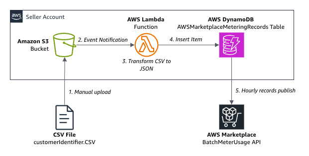
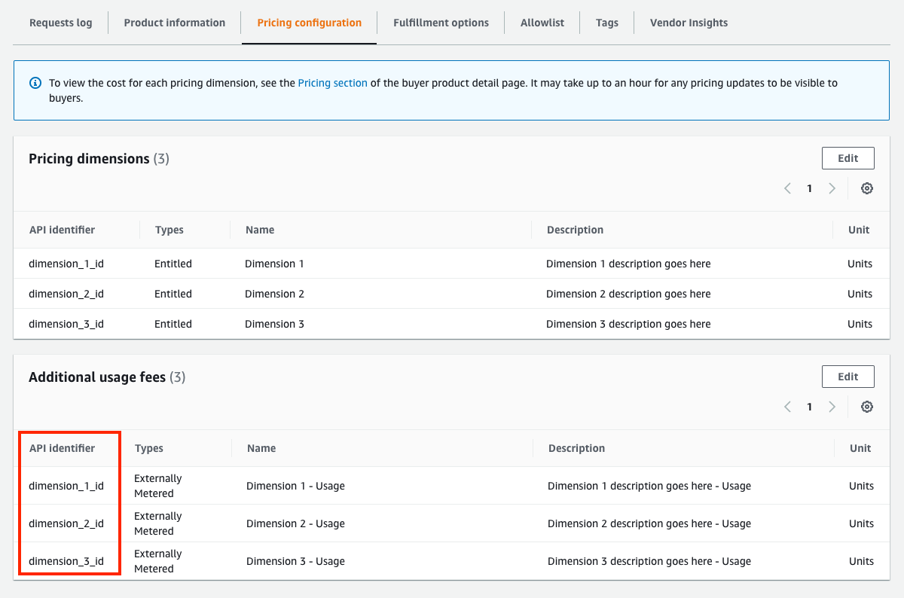
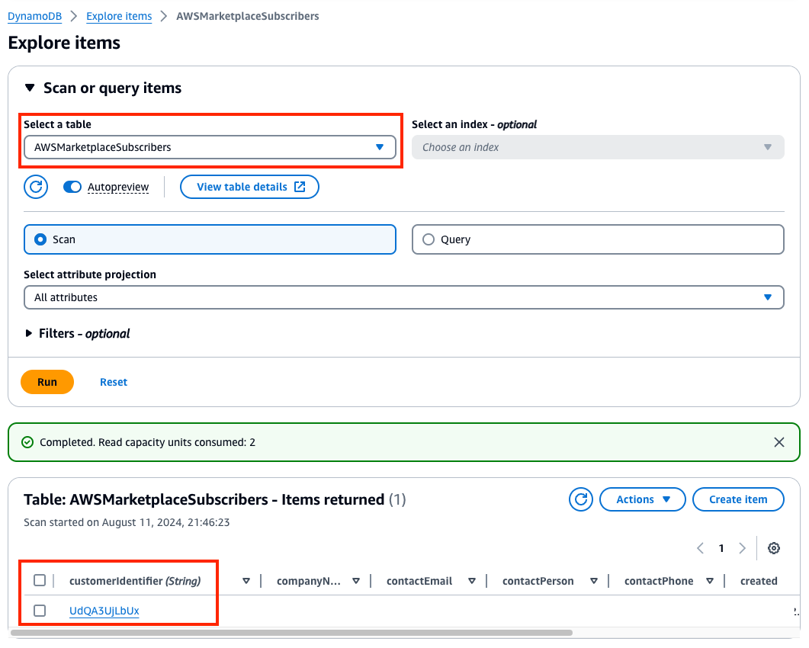
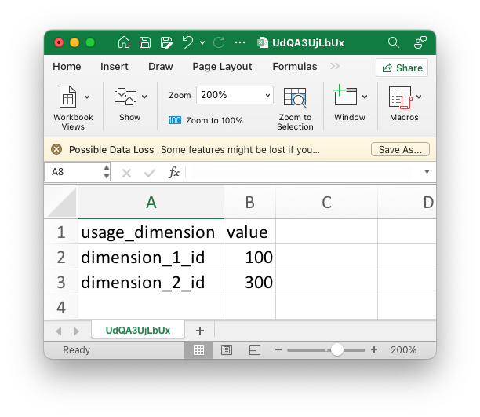
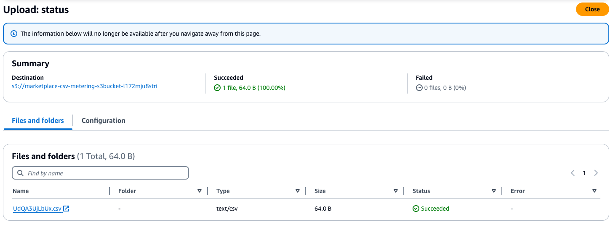
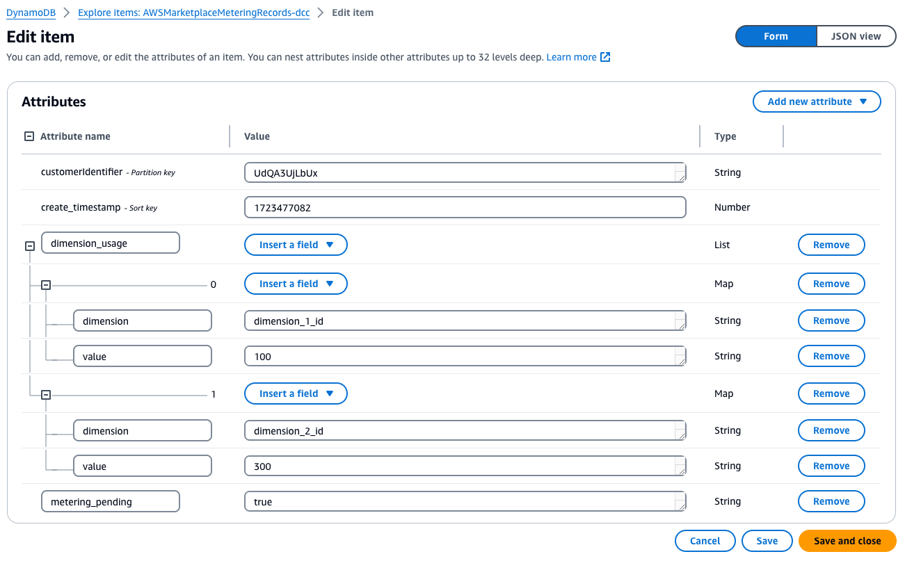
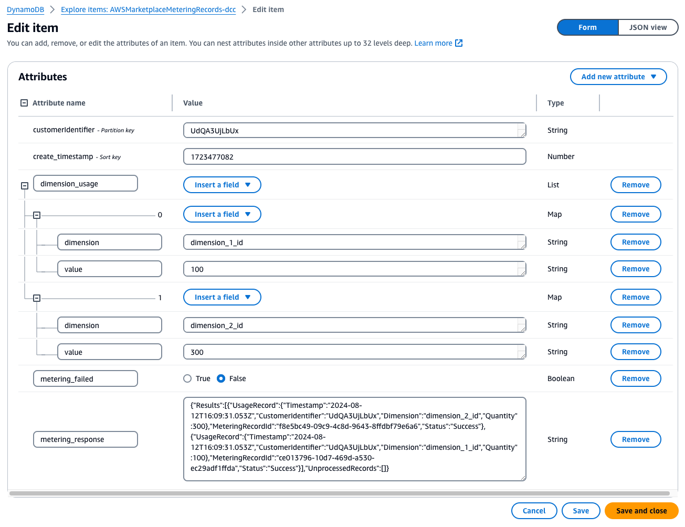

# AWS Marketplace CSV-based Metering Solution
This optional add-on works with the [AWS Marketplace Serverless SaaS Integration](https://github.com/aws-samples/aws-marketplace-serverless-saas-integration) to give sellers a manual, simple, CSV-based method for publishing custom metering usage to AWS Marketplace. **Do not** use this unless:
1. You have a Limited or Public listing for a SaaS product on AWS Marketplace.
2. Your listing uses "subscription" (usage-based) or "pay-as-you-go" (contract with consumption) [pricing models](https://docs.aws.amazon.com/marketplace/latest/userguide/saas-pricing-models.html). This does not work with contract-based pricing or other [product delivery methods](https://docs.aws.amazon.com/marketplace/latest/userguide/product-preparation.html).
3. You have deployed the [Serverless SaaS Integration](https://github.com/aws-samples/aws-marketplace-serverless-saas-integration).

## Intended for
This solution is optional, intended for:
- Manual reporting of [metered usage records](https://docs.aws.amazon.com/marketplace/latest/userguide/metering-for-usage.html) to AWS Marketplace.
- Sellers with a low volume of Marketplace transactions.
- Sellers who need a simple method for reporting metered usage records to AWS Marketplace without involving developers to build a custom integration between their system and AWS.
- Sellers who have a Sales Operations user (who doesn't have AWS administrator experience) that need to report metered records to AWS Marketplace on a recurring basis.

Sellers with high transaction volume of their Marketplace listing are encouraged to automate the metered records fully, by publishing customer usage data directly to DynamoDB from your backend system.

## How it works
1. **Manual upload**: Seller Operations user uploads a custom CSV with usage data from their SaaS application, for a specific customer ID gathered from the Subscribers DynamoDB table, to report metered usage for all dimensions and values listed in the CSV to AWS Marketplace.
2. **Event Notification**: A S3 Event Notification triggers a Lambda function automatically once the file is uploaded.
3. **Transform CSV to JSON**: The Lambda function reads the CSV file from the S3 bucket and processes each row of dimensions and values, plus the current timestamp, to created JSON inserting into the Metering Records DynamoDB table.
4. **Insert Item**: The Lambda function inserts the JSON containing the customer ID, all metered dimensions and values, and timestamp to DynamoDB.
5. **Hourly records publish**: Each hour, the Serverless SaaS Integration automatically processes any new records in DynamoDB and publishes them to the the Marketplace API, reflecting state and status back to DynamoDB.



## How to deploy the solution - AWS Administrator
To deploy the AWS Marketplace CSV-based Metering Solution, you'll want to access the AWS seller account as an administrator. Then follow these steps:
1. Obtain the Metering Records table name deployed by the [AWS Marketplace Serverless SaaS Integration](https://github.com/aws-samples/aws-marketplace-serverless-saas-integration) to your account (default is **AWSMarketplaceMeteringRecord**).
2. Using CloudFormation, create a new Stack using the **marketplace-csv-metering.yaml** template in this repo. Input the Subscriber table name into the **DynamoDBMeteringTableName**.
3. After the Stack is created successfully, navigate to the **Resources** tab and open the link to **S3Bucket**.
4. Under **Properties**, navigate to **Event notifications** and click **Create event notification**.
5. Create an event notification with the following configuration:
    1. Event name: **S3EventNotication**.
    2. Suffix: **.csv**
    3. Event types: **Put** / s3:ObjectCreated:Put (only).
    4. At the bottom, choose the Lambda function created by the Stack: **marketplace-csv-metering-UID**.
    5. Click **Save changes**.
7. Using IAM, modify the Role used by your Sales Operations user, attaching the following additional permissions. This will depend upon how you've setup access to your AWS account or granted existing policies to your Sales Operations user. These are the minimum permissions needed to read the DynamoDB tables and upload to the S3 bucket. Replace the values in `<brackets>` with actual values:

```
{
    "Version": "2012-10-17",
    "Statement": [
        {
            "Sid": "Statement1",
            "Effect": "Allow",
            "Action": [
                "s3:Get*",
                "s3:List*",
                "s3:Describe*",
                "s3:PutObject"
            ],
            "Resource": [
                "arn:aws:s3:::marketplace-csv-metering-s3bucket-<UID>",
                "arn:aws:s3:::marketplace-csv-metering-s3bucket-<UID>/*"
            ]
        },
        {
            "Sid": "Statement2",
            "Effect": "Allow",
            "Action": [
                "dynamodb:List*",
                "dynamodb:DescribeReservedCapacity",
                "dynamodb:DescribeLimits",
                "dynamodb:DescribeTimeToLive"
            ],
            "Resource": "*"
        },
        {
            "Sid": "Statement3",
            "Effect": "Allow",
            "Action": [
                "dynamodb:BatchGet*",
                "dynamodb:DescribeStream",
                "dynamodb:DescribeTable",
                "dynamodb:Get*",
                "dynamodb:Query",
                "dynamodb:Scan"
            ],
            "Resource": [
                "arn:aws:dynamodb:*:*:table/<AWSMarketplaceSubscribers>",
                "arn:aws:dynamodb:*:*:table/<AWSMarketplaceMeteringRecords>"
            ]
        }
    ]
}
```

The CSV Metering integration is now prepared and you can now provide steps (below) to your Sales Operations user for how to login to AWS, access DynamoDB and S3, and upload CSV files, using the following section.

## How to create and upload CSV metering records - Seller Operations
To publish metering records to AWS Marketplace for customer usage from your SaaS application, you will use the steps below to create and upload a CSV file for each customer. This process is manual and is recommended only for low Marketplace transaction volume.

1. Login to your AWS seller account, used to manage your AWS Marketplace Management Portal (MMP) product listings.
2. After logging into AWS, login to [MMP](https://aws.amazon.com/marketplace/management/homepage).
3. Navigate to your product listing under Products > SaaS.
4. Open the details of your Subscription or Pay-as-you-go product listing and navigate to **Pricing configuration**.
5. Under the **Usage fees**, note the **API identifier** of the usage dimensions configured for the product. These will be the available dimensions you use for publishing SaaS usage data to AWS Marketplace as metered records. In this example, we will use **dimension_1_id** and **dimension_2_id** usage dimensions.



6. Next, navigate to **DynamoDB** in the AWS Management Console. Open the Subscribers table (default is **AWSMarketplaceSubscribers**). Click **Explore table items** to view all items in the table, which reflect subscribers of your product. Find the **customerIdentifier** that corresponds to a customer that you need to published metered records for. You will use this to name your CSV. In this example, we will use **UdQA3UjLbUx** as the customerIdentifier.



7. Using **customerIdentifier.csv** as a template, create a new CSV file using a text editor or Microsoft Excel. Save the file locally, make a copy, and title it the customerIdentifier you obtained from the Subscribers DynamoDB table. (**UdQA3UjLbUx.csv**, in this example)


9. In the CSV file, fill-in the **usage_dimension** you obtained from step 5 (above) and the corresponding **value**, for the specific customerIdentifier. You can add multiple dimensions to one CSV, but you can only use one CSV per customerIdentifier. (**dimension_1_id** and **dimension_2_id** are the usage dimensions, in this example).



10. Next, navigate to the S3 bucket in AWS Management Console, named **marketplace-csv-metering-s3bucket-UID**. Upload the CSV to the bucket by clicking **Upload** and selecting the file. This will now automatically read the CSV file and write it to the DynamoDB table before publishing to AWS Marketplace.



12. Next, navigate back to the **DynamoDB** console and open the Metering Records table (default is **AWSMarketplaceMeteringRecord**). Click **Explore table items** and you will see an item for the **customerIdentifier** (UdQA3UjLbU) you just uploaded as a CSV. Click open the item and view the details to validate it looks correct. `metering_pending` will be set to `true`, meaning it hasn't yet been reported to AWS Marketplace.



13. Within an hour, the Serverless SaaS Integration will automatically update AWS Marketplace API with new records in batch. You can check DynamoDB again to validate the status change. `metering_failed` will be set to `false` and you will see the update status in `metering_response`.



15. Within a day, the CSV file will be automatically deleted from S3.
